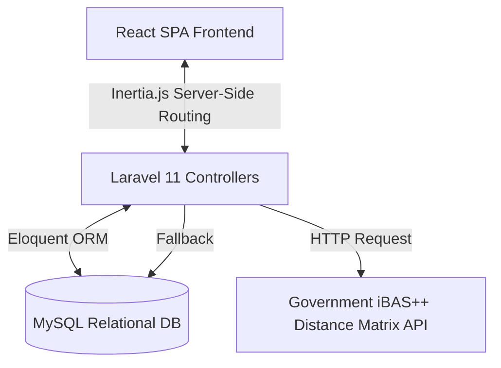
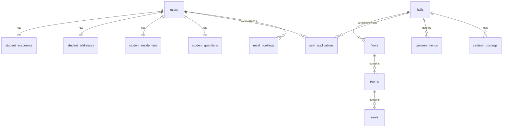

# HSTU Hall Manager: A Comprehensive Web-Based Hall Allocation and Canteen Management System for HSTU

**Prepared by:** Md. Asif Iqbal  
**Date:** July 4, 2026

---

## Abstract

As Hajee Mohammad Danesh Science and Technology University (HSTU) grows in student enrollment, managing residential allocation and canteen dining logistics becomes increasingly challenging. The traditional paper-based processes and manual verification methods have led to delays in seat allocations, scheduling errors, and significant food waste in dining halls. 

This report presents the design, architectural blueprint, and functional implementation details of the **HSTU Hall Manager** web application. Developed as a modern, single-page application (SPA), the system automates student residential profiles, seat application workflows, and weekly canteen schedules. By integrating directly with the Bangladesh Government's financial distance API (iBAS++) and employing a multi-criteria weighted sorting algorithm, the system validates home distances automatically and ranks applicants transparently based on merit, distance, and financial need. Additionally, the integrated canteen management module enforces previous-day meal bookings with strict daily cutoffs to optimize kitchen logistics. 

This paper outlines the technical architecture, database designs, core routing tables, and algorithms that realize a secure, paperless, and fair residence management solution for the university.

---

## Chapter 1: Introduction

University residential halls play a critical role in student life, particularly for students traveling from far-off districts to Hajee Mohammad Danesh Science and Technology University (HSTU) in Dinajpur. However, manual management systems present several inefficiencies:
1. **Inefficient Allocation**: Assigning seats based on academic performance, home distance, and financial background requires complex manual cross-referencing, often resulting in human error and lack of transparency.
2. **Manual Distance Validation**: Verifying students' home distances from official certificates is slow and prone to falsification.
3. **Dining Waste & Logistics**: Canteen managers cook food based on vague estimates, leading to food waste on low-attendance days or sudden shortages when attendance spikes.

The **HSTU Hall Manager** web application bridges these operational gaps. By combining a Laravel-driven robust backend with a responsive React frontend via Inertia.js, the platform offers roles for Students, Hall Provosts, Canteen Managers, and System Admins. The system features automated distance lookups, weighted priority ranking, and automated seat bookings, creating a modern, paperless residential environment.

---

## Chapter 2: Objectives

### 2.1 Primary Objectives
- **Centralize Residential Profiles**: Store detailed student academic progress (CGPA, Level, Semester), present/permanent addresses, and guardian financial records in a secure MySQL repository.
- **Automate Application Windows**: Allow Hall Provosts to configure and launch application periods with custom start/end times and notification banners.
- **Optimize Room & Seat Management**: Provide a visual allocation matrix mapping halls, floors, rooms, and seats, displaying real-time occupancy.
- **Enforce Meal Logistics**: Build a weekly menu and costing tracker where students can book meal units, enabling canteen staff to forecast daily counts.

### 2.2 Secondary Objectives
- **Integrate Official APIs**: Query the official government distance matrix (iBAS++) API to fetch road distances dynamically, falling back to local database mappings if unavailable.
- **Fair Merit-Need Seat Allocation**: Sort and prioritize pending applications using a weighted scoring formula combining CGPA, verified distance, and guardian income.
- **Minimize Dining Losses**: Enforce a strict previous-day 5:00 PM cutoff for meal bookings, eliminating last-minute catering fluctuations.

---

## Chapter 3: Methodology

### 3.1 System Architecture

The HSTU Hall Manager system uses a modern, multi-layered architecture:
1. **Backend Layer (Laravel 11)**: Manages requests, user authentication via Fortify, Eloquent ORM relationships, data validation, and third-party HTTP integrations.
2. **Frontend Layer (React & TypeScript)**: Delivers a responsive user experience with typed component structures, using Tailwind CSS and Lucide icons for UI layout.
3. **Connector Layer (Inertia.js)**: Acts as a bridge between Laravel routes and React components. Inertia handles client-side routing dynamically, passing Laravel controller properties directly into React views without manual REST API configurations.
4. **Data Layer (MySQL)**: A normalized database capturing residential data, room layouts, applications, menu logs, and distance maps.



### 3.2 System Flowchart & Logic

```
[Student Profile Setup]
         │
         ▼
[Complete Academic/Address Data]
         │
         ▼ (Fetch Distance)
[iBAS++ API / Local Fallback] ──► [Distance Saved to Address]
         │
         ▼
[Provost Opens Seat Application Window]
         │
         ▼
[Student Submits Application]
         │
         ▼
[Provost Sorts Applications (Weighted Priority Logic)]
         │
         ├──────────────────────────────┐
         ▼                              ▼
  [Approve & Seat Assigned]       [Deny Application]
         │                              │
         ▼                              ▼
 [Seat Booked & Res. Updated]      [Status: Denied]
```

#### Canteen Flow:
1. **Menu Setup**: Provost/Canteen Manager defines weekly menus (breakfast, lunch, dinner) per weekday.
2. **Daily Booking**: Student books meal units for future dates.
3. **Cutoff Rule**: Booking/editing is only allowed before **17:00 (5:00 PM)** of the previous day (`D-1`).
4. **Kitchen Summary**: Staff views aggregated units for a date to determine precise ingredient quantities.

---

### 3.3 Use Case Diagram Overview

The primary roles and their interactions with the system are described below:

| Actor | Target Module | Primary Use Cases |
| :--- | :--- | :--- |
| **System Admin** | Hall Management | Add/configure halls, assign Provosts/Superusers to halls, and track server system performance. |
| **Provost / Hall Super** | Seat & Canteen Admin | Configure application windows; filter/sort applications; allocate seats; deny applications; update weekly menus; set default/daily costing pricing; view kitchen summary counts. |
| **Student** | Student Portal | Update profile (academics, guardian, address); submit seat applications; view residential status & room assignment; book/modify daily meals; track canteen costing logs. |

---

### 3.4 Database Schema Overview

The database design contains 14 core tables, fully normalized to maintain data integrity:



#### Table: `users`
Represents the user records, supporting authentication and role-based permissions.
* `id` (PK, BigInt, AutoIncrement)
* `name` (String)
* `email` (String, Unique)
* `password` (String)
* `role` (Enum: `student`, `admin`, `hall_super`, `staff`)
* `hall_id` (FK, Nullable, references `halls.id`)

#### Table: `halls`
Defines the residential halls available on campus.
* `id` (PK, BigInt, AutoIncrement)
* `name` (String)
* `gender` (Enum: `male`, `female`)
* `application_start` (DateTime, Nullable)
* `application_end` (DateTime, Nullable)
* `application_message` (Text, Nullable)
* `is_application_active` (Boolean, Default: false)
* `canteen_default_breakfast_price` (Decimal, Default: 0)
* `canteen_default_lunch_price` (Decimal, Default: 0)
* `canteen_default_dinner_price` (Decimal, Default: 0)

#### Table: `floors`
Defines floors within each hall.
* `id` (PK, BigInt, AutoIncrement)
* `hall_id` (FK, references `halls.id`, Cascade)
* `name` (String)
* `floor_number` (Integer)

#### Table: `rooms`
Defines rooms located on a specific floor.
* `id` (PK, BigInt, AutoIncrement)
* `floor_id` (FK, references `floors.id`, Cascade)
* `room_number` (String)
* `purpose` (Enum: `residential`, `common_room`, `office`, `dining_hall`)
* `square_feet` (Decimal, Nullable)
* `capacity` (Integer, Default: 0)

#### Table: `seats`
Defines individual seats inside residential rooms.
* `id` (PK, BigInt, AutoIncrement)
* `room_id` (FK, references `rooms.id`, Cascade)
* `seat_number` (String)
* `status` (Enum: `available`, `booked`, Default: `available`)

#### Table: `student_academics`
Tracks student academic details for merit calculation.
* `id` (PK, BigInt, AutoIncrement)
* `user_id` (FK, references `users.id`, Unique, Cascade)
* `student_id` (String, Unique)
* `department` (String)
* `degree` (String)
* `level` (Integer, Range: 1–4)
* `semester` (String)
* `current_cgpa` (Decimal, Precision: 3, 2)

#### Table: `student_addresses`
Stores distance metrics and geographic addresses.
* `id` (PK, BigInt, AutoIncrement)
* `user_id` (FK, references `users.id`, Unique, Cascade)
* `perm_district` (String)
* `perm_upazilla` (String)
* `perm_village_area` (String)
* `pres_district` (String)
* `pres_upazilla` (String)
* `pres_village_area` (String)
* `distance_from_home` (Integer, Nullable, Unit: km)

#### Table: `student_residentials`
Connects an active student to an allocated seat.
* `id` (PK, BigInt, AutoIncrement)
* `user_id` (FK, references `users.id`, Unique, Cascade)
* `status` (Enum: `Residential`, `Non-Residential`, Default: `Non-Residential`)
* `hall_id` (FK, references `halls.id`, Nullable, SetNull)
* `seat_id` (FK, references `seats.id`, Nullable, SetNull)
* `staying_from` (Date, Nullable)

#### Table: `student_guardians`
Stores financial records used for need-based ranking.
* `id` (PK, BigInt, AutoIncrement)
* `user_id` (FK, references `users.id`, Unique, Cascade)
* `father_name` (String, Nullable)
* `mother_name` (String, Nullable)
* `guardian_name` (String, Nullable)
* `guardian_occupation` (String)
* `annual_income_amount` (Decimal, Precision: 10, 2)

#### Table: `seat_applications`
Tracks submissions from students applying for seat allocation.
* `id` (PK, BigInt, AutoIncrement)
* `student_id` (FK, references `users.id`, Cascade)
* `hall_id` (FK, references `halls.id`, Cascade)
* `status` (Enum: `pending`, `approved`, `denied`, Default: `pending`)
* `cgpa` (Decimal, Precision: 3, 2, Nullable)
* `guardian_income` (Decimal, Precision: 10, 2, Nullable)
* `distance_from_home` (Integer, Nullable)

#### Table: `canteen_menus`
Details the weekly food menu mapped to each hall.
* `id` (PK, BigInt, AutoIncrement)
* `hall_id` (FK, references `halls.id`, Cascade)
* `day_of_week` (String)
* `breakfast` (Text, Nullable)
* `lunch` (Text, Nullable)
* `dinner` (Text, Nullable)
* *Constraint*: Unique index on `['hall_id', 'day_of_week']`

#### Table: `canteen_costings`
Defines historical cost rates for individual dates.
* `id` (PK, BigInt, AutoIncrement)
* `hall_id` (FK, references `halls.id`, Cascade)
* `date` (Date)
* `breakfast_price` (Decimal, Precision: 10, 2, Default: 0)
* `lunch_price` (Decimal, Precision: 10, 2, Default: 0)
* `dinner_price` (Decimal, Precision: 10, 2, Default: 0)
* *Constraint*: Unique index on `['hall_id', 'date']`

#### Table: `meal_bookings`
Contains bookings placed by students.
* `id` (PK, BigInt, AutoIncrement)
* `user_id` (FK, references `users.id`, Cascade)
* `hall_id` (FK, references `halls.id`, Cascade)
* `date` (Date)
* `breakfast_units` (Integer, Default: 0)
* `lunch_units` (Integer, Default: 0)
* `dinner_units` (Integer, Default: 0)
* *Constraint*: Unique index on `['user_id', 'date']`

#### Table: `district_distances`
Stores static local fallback distance mappings.
* `id` (PK, BigInt, AutoIncrement)
* `district` (String, Unique)
* `distance` (Integer, Unit: km)

---

### 3.5 Core Algorithms & API Integrations

#### 3.5.1 iBAS++ Distance Matrix Integration
To automate distance verification, the backend queries the official Bangladesh Government financial system (iBAS++) API. 

- **Target URL**: `https://ibas.finance.gov.bd/Public/GetDistanceBetweenUpazillaForDistanceMatrix`
- **Constant Parameters**:
  - `departureLocationId = 231308` (Dinajpur Sadar - home of HSTU)
- **Dynamic Parameter**:
  - `arrivalLocationId = {upazila_id}` (retrieved from the student's address selection)

The application disables SSL verification to handle government server certificate chains gracefully. If the endpoint is down or returns a null value, the system extracts the student's district name and queries the local `district_distances` fallback table.

#### 3.5.2 Weighted Priority Allocation Algorithm
When reviews are active, the Provost can sort pending applications dynamically. The React dashboard processes this weighted scoring calculation:

$$\text{Priority Score} = (\text{CGPA} \times 1000) + (\text{Distance} \times 10) + \frac{1000000 - \text{Guardian Income}}{1000}$$

* **CGPA (Merit)**: Mapped to a high scale factor (e.g. CGPA of $3.80 \times 1000 = 3800$ points).
* **Distance (Need)**: Assesses distance in km (e.g. $400\text{ km} \times 10 = 4000$ points).
* **Guardian Income (Need)**: Awards higher points to lower-income households. A student with an annual income of $120,000$ BDT earns $(1,000,000 - 120,000) / 1000 = 880$ points, whereas an income of $500,000$ BDT earns only $500$ points.

This weighted formula ensures that decisions combine academic performance, student displacement, and financial capacity.

#### 3.5.3 Canteen Meal Booking & Cutoff Rules
To prevent food waste, bookings are locked behind a strict temporal constraint:

$$\text{Cutoff} = \text{Date}_{\text{Booking}} - 1\text{ Day at } 17:00\text{ Hours (5:00 PM)}$$

If a student tries to book or edit units for Monday, July 6, the system validates that the request is received before Sunday, July 5 at 5:00 PM. Any request after this deadline returns a validation error.

---

## Chapter 4: Results

### 4.1 Functional Outcomes
- **Clash Prevention**: The relational constraints on rooms and seats ensure that a seat marked as `booked` cannot be reassigned to another student, eliminating double-bookings.
- **Fair Allocation**: The Provost's dashboard displays sorted lists based on the priority scoring formula, removing subjectivity from the allotment process.
- **Accurate Kitchen Metrics**: The canteen manager has access to aggregated counts of breakfast, lunch, and dinner units for any upcoming date, facilitating precise ingredient purchasing.

### 4.2 User Interface Highlights
- **Provost Allocation Portal**: Displays total students, residential occupancy, and active applications. It features sorting checkboxes for CGPA, Distance, and Income, along with seat assignment dropdowns categorized by floor and room.
- **Student dashboard**: Shows active residential assignments and contains notices regarding open application cycles.
- **Weekly Menu Panel**: Formats breakfast, lunch, and dinner plans for the week, providing transparency on meal options.
- **Canteen Log**: Allows students to book meals and view costing records, while enforcing the 5:00 PM daily cutoff.

---

## Chapter 5: Conclusion and Future Plan

### 5.1 Conclusion
The **HSTU Hall Manager** web application introduces digital organization to student housing and dining logistics. By replacing manual paperwork with automated distance verification, weighted application rankings, and strict meal booking cutoffs, the platform improves administrative efficiency and reduces dining room losses.

### 5.2 Future Development Plan
1. **MFS Payment Gateway Integration**: Integrate mobile financial services (such as bKash, Rocket, or Nagad) directly into the Laravel backend to automate seat rent and canteen billing collections.
2. **QR Code Verification**: Generate dynamic, date-specific QR code tickets on the student dashboard for canteen staff to scan at the serving line.
3. **IoT Access Control**: Connect the residential database with RFID/biometric turnstiles at hall gates, ensuring only authorized residents can access the facility.
